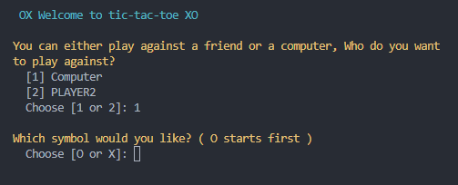
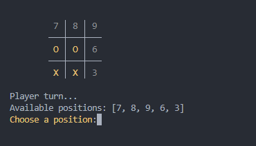
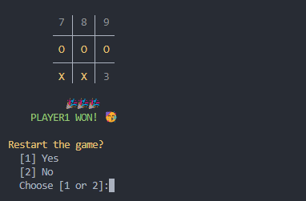

# XO Game
A collage python terminal game project.

# Screenshots





# Install and Run
## Install requirements
### using pip
```terminal
pip install -r ./requirements.txt
```
### or Conda
```terminal
conda install --file ./requirements.txt
```

## Run
```terminal
python ./main.py
```

# Features

- Player vs Player
- Player vs Computer
- User friendly controls with Numpad


# Author
[Abdulmalik Almushaiqah](http://github.com/reex11)